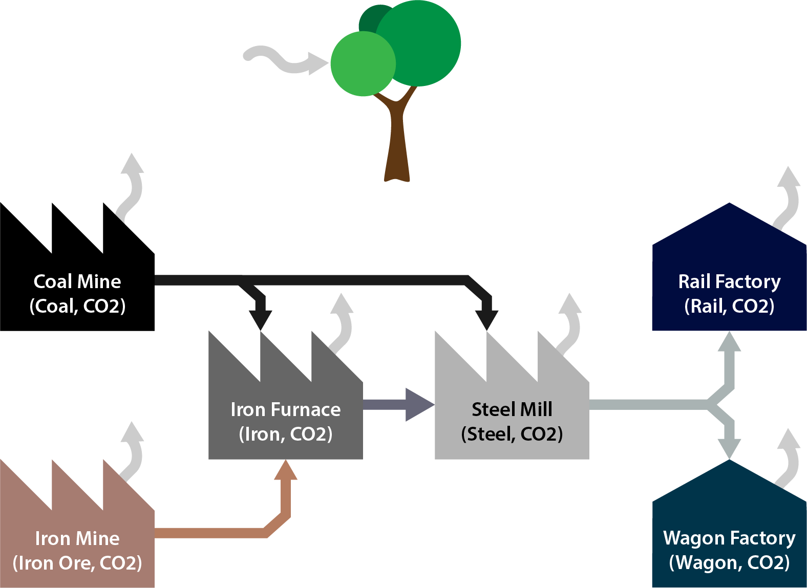

# *mat_dp_core.***measure**

Measure is the workhorse of Mat-dp core; resources, constraints, processes, and an objective function have set a stage and provided inputs, and Measure will solve the system according to these.

## **Objective Example Continued**

The most basic usage of measure should not be too difficult, see the complete code for the '3 power plants' example below:

```py
from mat_dp_core import Resources, Processes, GeConstraint, LeConstraint, Measure

r = Resources()
electricity = r.create("electricity", "kwh")
carbon_dioxide = r.create("CO2", "tonnes")

p = Processes()
coal_plant = p.create("Coal Power Plant", (carbon_dioxide, 1), (electricity, 100))
gas_plant = p.create("Gas Power Plant", (carbon_dioxide, 0.6), (electricity, 100))
organic_plant = p.create("Organic Mass Power Plant", (carbon_dioxide, 0.8), (electricity, 100))
environment = p.create("The Atmosphere", (carbon_dioxide, -1))
grid = p.create("The Energy Grid", (electricity, -100))

coal_capacity = LeConstraint("Coal Plant Capacity 2,000kwh", coal_plant, 20)
gas_capacity = LeConstraint("Gas Plant Capacity 1,500kwh", gas_plant, 15)
organic_capacity = LeConstraint("Organic Plant Capacity 1,000kwh", organic_plant, 10)
grid_needs = GeConstraint("Grid Requirement of 2,200kwh", grid, 22)

objective = environment

# constraints must be passed to measure in a list, so we put them in a list here.
constraints = [coal_capacity, gas_capacity, organic_capacity, grid_needs]

# To solve this system, only 4 parameters need to be passed:
measure = Measure(resources=r, processes=p, constraints=constraints, objective=objective)


# For display purposes:
print("\n\n\nTonnes of CO2 produced by process:\n")
for process in measure.resource(resource=carbon_dioxide):
    print(str(process[0].name).ljust(30) + ":  " + str(round(process[1], 1)))

print("\n\n")

print("kwh of electricity produced by process:\n")
for process in measure.resource(resource=electricity):
    print(str(process[0].name).ljust(30) + ":  " + str(round(process[1], 1)))

"""


>>> Tonnes of CO2 produced by process:

>>> Coal Power Plant              :  0.0
>>> Gas Power Plant               :  9.0
>>> Organic Mass Power Plant      :  5.6
>>> The Atmosphere                :  -14.6
>>> The Energy Grid               :  0.0


>>> kwh of electricity produced by process:

>>> Coal Power Plant              :  0.0
>>> Gas Power Plant               :  1500.0
>>> Organic Mass Power Plant      :  700.0
>>> The Atmosphere                :  0.0
>>> The Energy Grid               :  -2200.0
"""
```

## **Measure()**

The ```Measure``` class is responsible for solving a system.  
Just one ```Measure``` object is made to handle this.  

---

**Summary:**  
*Creates an instance of the ```Measure``` class, which will immediately attempt to solve the MAT-DP system.*

**Parameters:**

* `resources` Resources  
  *Resources object*

* `processes` Processes  
  *Processes object*

* `constraints` \[constraints\]  
  *A list of all constraints involved in the system.*

* `objective` the objective function  
  *The objective function being applied to this system.*

* `maxiter` int - OPTIONAL, default `None`  
  *Allows assignment of the maximum number of iterations for the solver to run*

* `allow_inconsistent_order_of_mag` bool - OPTIONAL, default `False`  
  *Permits inconsistent orders of magnitude (advanced).*

**Return Type:**  ```Measure```

**Location:** `measure.py - class Measure`

**Example Code:**

```py
measure = Measure(resources=r, processes=p, constraints=constraints, objective=objective)
```

---

## **Methods**

### `.run()`

**Summary:**  
*Returns the number of runs for a particular process or all the processes in the system. Optionally returns these with consideration for bounds.*

**Location:** `measure.py - class Measure`

---

#### **Option 1**  
**Parameters:**

* ```bounds``` bool  
  *Specifies whether bounds should be considered.*

**Return Type:**  ```[[_processes, run_vector, run_vector_lb, run_vector_ub], [...]]``` or ```[[_processes, run_vector]]```

---

#### **Option 2**  
**Parameters:**

* ```process``` process variable  
  *Specifies which specific process' run count should be returned.*

* ```bounds``` bool  
  *Specifies whether bounds should be considered.*

**Return Type:**  ```[runs, runs_lb, runs_ub]``` or ```[runs]```


---

### `.resource()`

**Summary:**  
*Used to return information regarding resource input or output in relation to processes - for a full map of 'resource responsibility', see `cumulative_resource()`. Available with various options.*

**Location:** `measure.py - class Measure`

---

#### **Option 1**  

**Description:**  
*Returns measurements for all processes and resources.*

**Parameters:**

* ```bounds``` bool  
  *Whether or not to calculate bounds.*

**Return Type:**  ```list```

---

#### **Option 2**  

**Description:**  
*Returns input and output resource values for the process specified.*

**Parameters:**

* ```process``` process variable  
  *A process to be measured.*

* ```bounds``` bool  
  *Whether or not to calculate bounds.*

**Return Type:**  ```list```

---

#### **Option 3**  
**Parameters:**

* ```resource```  
  *The resource to be measured.*

* ```bounds```  
  *Whether or not to calculate bounds.*

**Return Type:**  ```list```

---

#### **Option 4**  
**Parameters:**

* ```process``` process variable  
  *The process to be measured.*

* ```resource``` resource variable  
  *The resource to be measured.*

* ```bounds``` bool - OPTIONAL, default False  
  *Whether or not to calculate bounds.*

**Return Type:**  ```list```

---

### `.flow()`

**Summary:**  
*Used to return information regarding __flow__ of resources between directly linked processes. Available with various options.*

**Location:** `measure.py - class Measure`

---
#### **Option 1**  
**Summary:**  
*Returns all flows between each process pair and each resource.*

**Parameters:**

* ```bounds``` bool - OPTIONAL, default False  
  *Whether or not to calculate bounds.*

**Return Type:**  ```list```

---

#### **Option 2**  
**Summary:**  
*Returns all flows between the process pair specified.*

**Parameters:**

* ```process_from``` process variable  
  *The process that the resource is flowing from.*

* ```process_to``` process variable  
  *The process that the resource is flowing into.*

* ```bounds``` bool - OPTIONAL, default False  
  *Whether or not to calculate bounds.*

**Return Type:**  ```list```

---

#### **Option 3**  
**Summary:**  
*Returns all flows for the resource specified.*

**Parameters:**

* ```resource``` resource variable  
  *The resource to measure flows for.*

* ```bounds``` bool - OPTIONAL, default False  
  *Whether or not to calculate bounds.*

**Return Type:**  ```list```

---

#### **Option 4**  
**Summary:**  
*Returns the sum of all outflows from this process for each resource.*

**Parameters:**

* ```process_from``` process variable  
  *The process that the resources are flowing from.*

* ```bounds``` bool - OPTIONAL, default False  
  *Whether or not to calculate bounds.*

**Return Type:**  ```list```

---

#### **Option 5**  
**Summary:**  
*Returns the sum of all outflows from this process for this resource.*

**Parameters:**

* ```process_from``` process variable  
  *The process material is flowing from.*

* ```resource``` resource variable  
  *The resource that is flowing.*

* ```bounds``` bool - OPTIONAL, default False  
  *Whether or not to calculate bounds.*


**Return Type:**  ```list```

---

#### **Option 6**  
**Summary:**  
*Returns the sum of all inflows into this process for each resource.*

**Parameters:**

* ```process_to``` process variable  
  *The process material is flowing to.*

* ```bounds``` bool - OPTIONAL, default False  
  *Whether or not to calculate bounds.*


**Return Type:**  ```list```

---

#### **Option 7**  
**Summary:**  
*Returns the sum of all inflows into this process for this resource.*

**Parameters:**

* ```process_to``` process variable  
  *The process that the resource is flowing into.*

* ```resource``` resource variable  
  *The resource to measure.*

* ```bounds``` bool - OPTIONAL, default False  
  *Whether or not to calculate bounds.*


**Return Type:**  ```list```

---

#### **Option 8**  
**Summary:**  
*Returns the value of resource flow for the given process pair and resource.*

**Parameters:**

* ```process_from``` process variable  
  *The process that the resource is flowing from.*

* ```process_to``` process variable  
  *The process that the resource is flowing into.*

* ```resource``` resource variable  
  *The resource to measure.*

* ```bounds``` bool  
  *Whether or not to calculate bounds.*

**Return Type:**  ```list```

---


### `.cumulative_resource()`

**Summary:**  
*Calculates resources leading up to all processes, or a given process. For example, all the steel contributing the manufacture of a boat. Available with various options.*

**Location:** `measure.py - class Measure`

---

#### **Option 1**  
**Summary:**  
*Returns the amount of each resource used for the entire chain of processes that led to each process.*

**Parameters:**

* ```bounds``` bool - OPTIONAL, default False  
  *Whether or not to calculate bounds.*

**Return Type:**  ```list```

---

#### **Option 2**  
**Summary:**  
*Returns the amount of each resource used for the entire chain of processes that led to __this__ process.*

**Parameters:**

* ```process``` process variable  
  *The process that the resource is flowing into.*

* ```bounds``` bool - OPTIONAL, default False  
  *Whether or not to calculate bounds.*

**Return Type:**  ```list```

---

#### **Option 3**  
**Summary:**  
*Returns the amount of a given resource used for the entire chain of processes that led to each process.*

**Parameters:**

* ```resource``` resource variable  
  *The resource to be measured.*

* ```bounds``` bool - OPTIONAL, default False  
  *Whether or not to calculate bounds.*

**Return Type:**  ```list```

---

#### **Option 4**  
**Summary:**  
*Returns the amount of a given resource used for the entire chain of processes that led to this process.*

**Parameters:**

* ```process``` process variable  
  *The process that the resource is flowing into.*

* ```resource``` resource variable  
  *The resource to be measured.*

* ```bounds``` bool - OPTIONAL, default False  
  *Whether or not to calculate bounds.*

**Return Type:**  ```list```

---

## **Example Code**

**Overview**

The below worked example shows the (simplified) CO2 side effects leading to steel rail and railway wagon manufacture (assuming 500 metres and 5 wagons produced).

See the below diagram for an overview of the system:



```py

from mat_dp_core import Resources, Processes, GeConstraint, LeConstraint, Measure

r = Resources()
iron_ore = r.create("Iron Ore", "metric tonnes")
iron = r.create("Iron", "metric tonnes")
coal = r.create("Coal", "metric tonnes")
carbon_dioxide = r.create("CO2", "metric tonnes")
steel = r.create("Steel", "metric tonnes")
rail = r.create("Steel Rail", "metres")
wagon = r.create("Railway Wagon", "units")

p = Processes()
coal_mine = p.create("Coal Mine", (carbon_dioxide, 0.2), (coal, 1.0))
iron_mine = p.create("Iron Ore Mine", (carbon_dioxide, 0.2), (iron_ore, 1.0))
iron_furnace = p.create("Iron Blast Furnace", (carbon_dioxide, 0.5), (iron, 1.0), (coal, -0.4), (iron_ore, -1.2))
steel_mill = p.create("Steel Mill", (carbon_dioxide, 0.7), (iron, -0.9), (coal, -0.5), (steel, 1.0))
rail_factory = p.create("Rail Manufacturing Factory", (carbon_dioxide, 0.1), (steel, -0.1), (rail, 1.0))
rail_wagon_factory = p.create("Wagon Manufacturing Factory", (carbon_dioxide, 0.3), (steel, -4.0), (wagon, 1.0))
environment = p.create("The Atmosphere", (carbon_dioxide, -1.0))

rail_buy = p.create("Economy demanding rail", (rail, -1))
wagon_buy = p.create("Economy demanding wagons", (wagon, -1))

# Constraints
rail_demand = GeConstraint("Demand for rail", rail_buy, 500)
wagon_demand = GeConstraint("Demand for wagons", wagon_buy, 5)

objective = environment

constraints = [rail_demand, wagon_demand]

measure = Measure(r, p, constraints, objective)

# .run()

print("---\nNumber of runs for every process:")
print(measure.run(bounds=False)) # Option 1
print("---\nNumber of runs of the coal mine only:")
print(measure.run(process=coal_mine, bounds=False)) # Option 2

# .resource()
print("---\nNet immediate resource production for every process:")
print(measure.resource(bounds=False)) # Option 1
print("---\nIron Mine is directly responsible for the following Resources:")
print(measure.resource(process=iron_mine,bounds=False)) # Option 2
print("---\nThe following Processes are directly responsible for the following amounts of Carbon Dioxide:")
print(measure.resource(resource=carbon_dioxide, bounds=False)) # Option 3
print("---\nThe Rail Factory is directly responsible for this much Carbon Dioxide:")
print(measure.resource(process=rail_factory, resource=carbon_dioxide, bounds=False)) # Option 4

# .flow()

print("---\n\n1) All flows from everything to everything:")
print(measure.flow()) # Option 1

print("---\n\n2) Flow of all resources from the iron mine to the iron furnace:")
print(measure.flow(process_from=iron_mine, process_to=iron_furnace)) # Option 2

print("---\n\n3) All flows of iron:")
print(measure.flow(resource=iron)) # Option 3

print("---\n\n4) The sum of all outflows from the steel mill for each resource:")
print(measure.flow(process_from=steel_mill)) # Option 4

print("---\n\n5) The sum of all outflows from the steel mill for steel:")
print(measure.flow(process_from=steel_mill, resource=steel)) # Option 5

print("---\n\n6) The sum of all inflows to the steel mill for every resource:")
print(measure.flow(process_to=steel_mill)) # Option 6

print("---\n\n7) The sum of all inflows to the wagon factory for steel:")
print(measure.flow(process_to=rail_wagon_factory, resource=steel)) # Option 7

print("---\n\n8) The sum of CO2 between the iron mine and the atmosphere:")
print(measure.flow(process_from=iron_mine, process_to=environment, resource=carbon_dioxide)) # Option 8

# .cumulative_resource()

# This example of cumulative_resource() is not yet operational
# See issue #16 on (https://github.com/dreamingspires/mat-dp-core) for details.
"""
print("---\n\n1) All cumulative resource flows from everything to everything:")
print(measure.cumulative_resource()) # Option 1

print("---\n\n2) All cumulative resource flows from everything to the wagon factory:")
print(measure.cumulative_resource(process=rail_wagon_factory)) # Option 2

print("---\n\n3) Cumulative resource flows of iron from everything to everything::")
print(measure.cumulative_resource(resource=iron)) # Option 3

print("---\n\n4) Cumulative amount of CO2 leading up to all the production rail factory:")
print(measure.cumulative_resource(process=rail_factory, resource=carbon_dioxide)) # Option 4
"""

```

